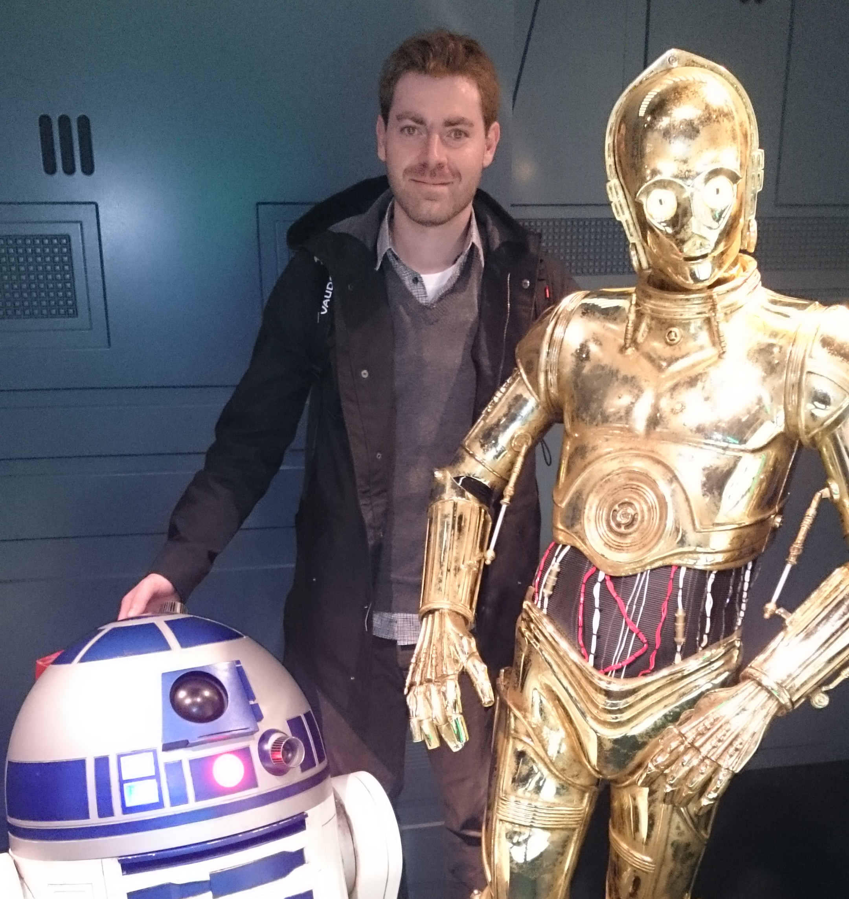
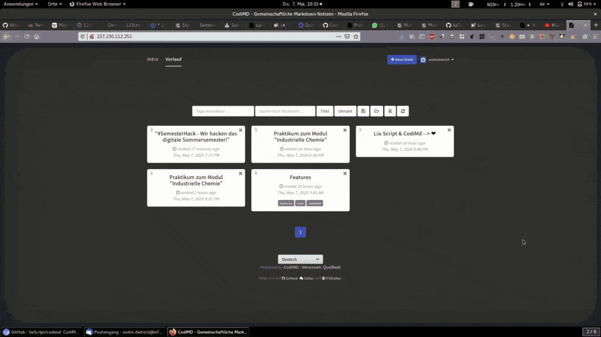
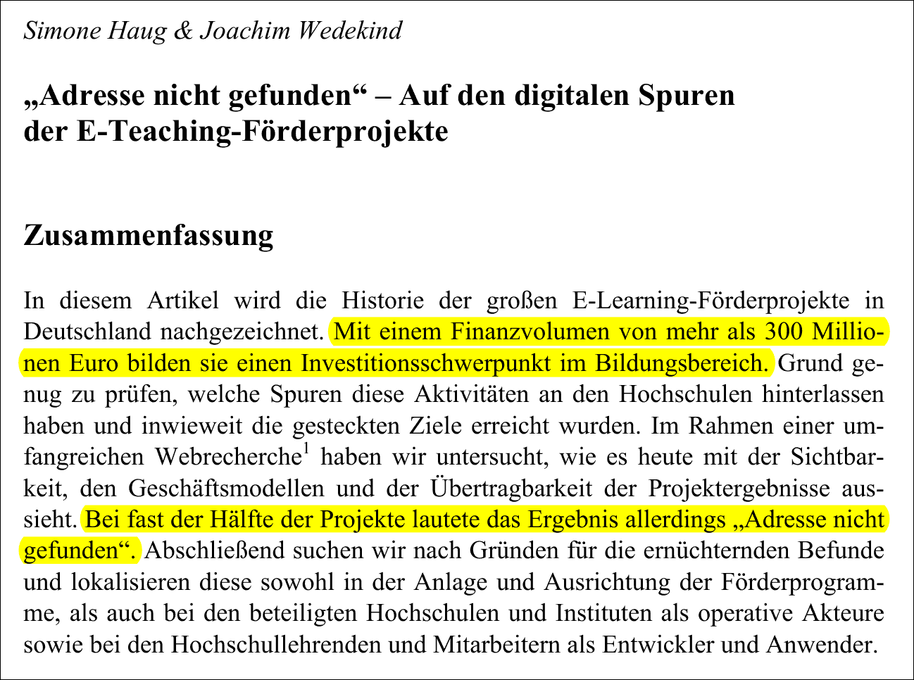
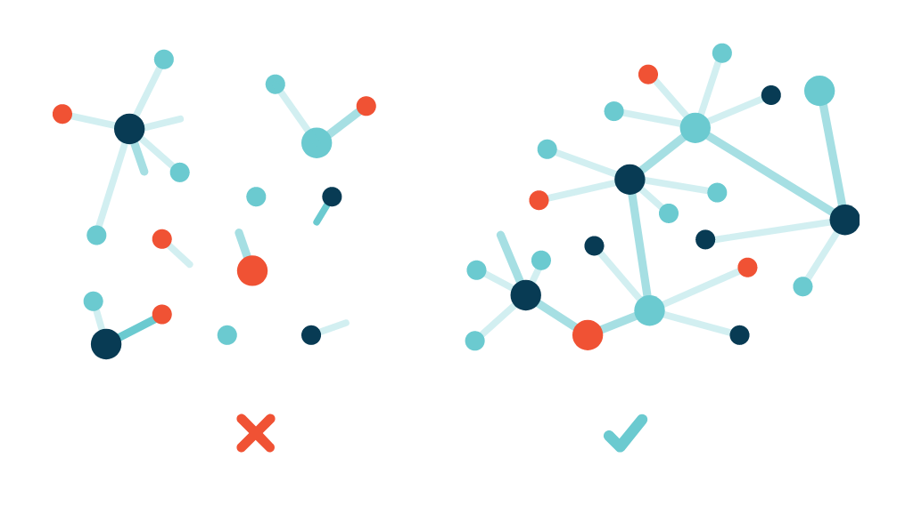

<!--
author:   André Dietrich

email:    LiaScript@web.de

version:  0.0.1

language: en

narrator: US English Male

comment:  Presentation for the pannel discussion at AMIA 2022.

import: https://raw.githubusercontent.com/liaTemplates/vtk/master/README.md
import: https://raw.githubusercontent.com/liaTemplates/AVR8js/main/README.md

-->

# AMIA-Presentation-2022


                      --{{0}}--
Hi, my name is André Dietrich. This is an older picture of me, when I was mostly working as a robotics and embedded software developer. I am the guy in the background and by the way, the voice that you hear is not mine, it is automatically generated for this presentation, which uses LiaScript as a markup-language for creating and sharing educational content, as you can see on the left side of this recording.



## Research & History

                      --{{0}}--
As already mentioned, I was mostly working with robots, sensors, IoT-devices, but after my Ph.D. I joined the industrial e-Lab project and now I work as a researcher at [Freiberg University of Mining and Technology](https://tu-freiberg.de) in Saxony as a member of the CrossLab-Project, funded by the German [Foundation for Innovation in University Teaching](https://stiftung-hochschullehre.de/projekt/crosslab/). In both projects, we tried to make university hardware and labs accessible to students 24/7 via the internet.

                       {{0-2}}
!?[Industrial eLab demo Video](https://www.youtube.com/watch?v=bICfKRyKTwE&autoplay=1&color=blue&Playsinline=1&cc_load_policy=1&enablejsapi=1)


                      --{{1}}--
Thus, I had to switch to web-development. Within the first project we quickly found out, that simply offering one (mostly too complex) user-interface per laboratory and to ship the educational content separately via PDF, HTML, etc. did not provide an optimal solution for us. Using another LMS was in most cases not practical, and it was even for us as developers far too complex and time-consuming.


                      --{{2}}--
I was always fascinated by programming languages and paradigms, so I convinced my colleagues and started to work on LiaScript. It is based on Markdown an easy to learn markup-language, which is widely used in computer science, documentation, and blogging. The starting point was to make the static Markdown more interactive and apply the possibility to integrate quizzes and videos.


                       {{2-3}}



                      --{{3}}--
Step by step, we found out, that lots of coding task can also be integrated into LiaScript. Thus, instead of developing user interfaces for different labs, we started to develop service-platforms that can be easily integrated into different courses and thus used for different purposes.


                       {{3-4}}
<div id="example">
<wokwi-led color="red"   pin="13" label="13"></wokwi-led>
<wokwi-led color="green" pin="12" label="12"></wokwi-led>
<wokwi-led color="blue"  pin="11" label="11"></wokwi-led>
<wokwi-led color="blue"  pin="10" label="10"></wokwi-led>
<span id="simulation-time"></span>
</div>

                       {{3-4}}
``` cpp
byte leds[] = {13, 12, 11, 10};
void setup() {
  Serial.begin(115200);
  for (byte i = 0; i < sizeof(leds); i++) {
    pinMode(leds[i], OUTPUT);
  }
}

int i = 0;
void loop() {
  Serial.print("LED: ");
  Serial.println(i);
  digitalWrite(leds[i], HIGH);
  delay(250);
  digitalWrite(leds[i], LOW);
  i = (i + 1) % sizeof(leds);
}
```
@AVR8js.sketch(example)


                      --{{4}}--
But, this language-based approach can also be extended freely in various different ways ...


                        {{4}}
@VTK.loadIframe(https://kitware.github.io/vtk-js-datasets/data/vti/head-binary-zlib.vti)


## Problems

                      --{{0}}--
With LiaScript we have accidentally developed an alternative approach to the creation of educational content. Create a course aka text-file and host it everywhere (even for free). Deal mostly with the content and let interpreter find out, how to present it on different devices and thus enable multi-authorship and collaboration.


                       {{0-1}}
<div style="width:100%;height:0;padding-bottom:75%;position:relative;"><iframe src="https://giphy.com/embed/CH2bHGLTTf3gYHvfP5" width="100%" height="100%" style="position:absolute" frameBorder="0" class="giphy-embed" allowFullScreen></iframe></div><p><a href="https://giphy.com/gifs/travisband-travis-fran-healy-gaby-cam-CH2bHGLTTf3gYHvfP5">via GIPHY</a></p>


                      --{{1}}--
The content might be textual, but we improve the interpreter continuously and make LiaScript smarter, such that by the time the presentation/interpretation and interaction with the material gets improved, but your content stays the same.

                       {{1-2}}
<div style="width:100%;height:0;padding-bottom:75%;position:relative;"><iframe src="https://giphy.com/embed/UI7EYk96rzq24" width="100%" height="100%" style="position:absolute" frameBorder="0" class="giphy-embed" allowFullScreen></iframe></div><p><a href="https://giphy.com/gifs/different-UI7EYk96rzq24">via GIPHY</a></p>        


                      --{{2}}--
The more we apply it, the more it seems natural to us, and more and more we see problems in other "standard" solutions. I would like to approach the discussion from a technological perspective:

                        {{2}}
- Sustainability
- Complexity
- Bandwidth consumption
  (& the need for a stable internet connection)
- Accessibility
- Language barriers
- Creation & Adaptability


### Address not found - On the digital trail of e-teaching funding projects (2009 - Germany)

                      --{{0}}--
The image shows a summary of a 2009 report on the trails of digital e-teaching platforms. The shocking news is that a half of the developed solutions and thus the content cannot be accessed anymore and thus are lost forever. Just think about it, the [average lifespan of a website is 100 days](https://blogs.loc.gov/thesignal/2011/11/the-average-lifespan-of-a-webpage/) before it might vanish...




> ## Source: ['Adresse nicht gefunden' - Auf den digitalen Spuren der E-Teaching-Förderprojekte](https://www.pedocs.de/volltexte/2011/3215/pdf/Haug_Wedekind_Adresse_nicht_gefunden_D_A.pdf)
>
> __Summary__
>
> ... With a financial volume of more than 300 million euros, they form an investment focus in the education sector...
>
> ... In almost half of the projects, however, the result was "address not found"...


### Platforms?

                      --{{0}}--
Platforms might be a solution? Really?
As the data shows, there is a huge amount of LMSs that differ between institutions, countries, and continents. From one perspective, this is great, since it supports the competition and evolution of such systems. But, and this is a major drawback, these systems also separate or isolate the creators of educational content. People get stuck to one system or another, without the chance of building communities through topics.


<!-- data-transpose data-show -->
| Market Share of LMS in 2016 | Europe |
|:--------------------------- | ------:|
| Blackboard learn            |    192 |
| Canvas                      |     16 |
| Claroline                   |     32 |
| D2L Brightspace             |     16 |
| GUNET eClass                |     32 |
| Ilias                       |     64 |
| Itslearning                 |     32 |
| Moodle                      |   1043 |
| Olat                        |     17 |
| Others                      |     80 |
| Sakai                       |     48 |
| Stud.IP                     |     32 |


                      --{{1}}--
Of course, there is mostly also the possibility of exporting content in a way, that it can be uploaded to various platforms (e.g., [SCORM](https://en.wikipedia.org/wiki/Sharable_Content_Object_Reference_Model), [xAPI](https://en.wikipedia.org/wiki/Experience_API), [AICC](https://en.wikipedia.org/wiki/Aviation_Industry_Computer-Based_Training_Committee), [etc.](https://www.ispringsolutions.com/blog/ispring-now-supports-cmi5-the-next-generation-of-scorm)), but this does not allow for multiple authors and versioning, as it is common in most open-source communities.


### Bandwidth & Offline-First

                      --{{0}}--
If we are honest, most of the solutions so far require a stable internet connection, even if it is only required to check a quiz - answer.

__How many Africans have access to the Internet?__

    [( )] more than 80%
    [( )] more than 60%
    [( )] more than 40%
    [(X)] less than 25%


                      --{{1}}--
In general, only 24.4% of the African population have access to the Internet, as of 2018. Only 0.4% of the African population has a fixed-broadband subscription. The majority of internet users use it through mobile broadband.

                        {{1}}
](https://en.wikipedia.org/wiki/Internet_in_Africa)")


                      --{{2}}--
Thus, if we really want to make a change, we have to provide e-learning solutions that are not bandwidth greedy or even better than that, which also work offline. The picture shows a Feature-Phone running a LiaScript - course. In Africa and other developing areas, such feature phones have a larger market share than iPhone and Android.

                        {{2}}


## Solution?

                      --{{0}}--
From my perspective, new and underrated approaches from Web 3.0 provide a solution. We don't need web servers when content can be created directly within the browser. The video shows a demo of the [Beaker Browser](https://beakerbrowser.com), which allows creating and distribute via a peer to peer system. LiaScript courses can also be created and shared with this browser.

                     {{0-1}}
!?[Beaker Browser Demo](https://beakerbrowser.com/beaker-site-demo.mp4)<!--autoplay="true"-->

                    --{{1}}--
In the same manner, the [interplanetary file system](https://ipfs.tech)(in short IPFS) is an approach for the decentralized web, in which content can be delivered with or without internet backbone connectivity. Thus, even without a stable Internet connection, it is possible to share content between devices. Browsers such as the [Brave Browser](https://brave.com) already implement this protocol.

                      {{1}}



## Find out more ...

                      --{{0}}--
To find out more about our project, check out one of the following links or follow us on Twitter.

The LiaScript project is hosted on GitHub:

https://LiaScript.github.io

The source code and more examples:

https://github.com/LiaScript

Information about the CrossLab-Project: 

https://cross-lab.org

Twitter: https://twitter.com/LiaScript

---

                      --{{1}}--
See you soon and in person in Washington.

                        {{1}}
*********************************************************

      {{|> Deutsch Male}}
Bis bald und persönlich in Washington.

      {{|> Spanish Female}}
Nos vemos pronto y en persona en Washington.

      {{|> Chinese Male}}
很快在华盛顿见。

*********************************************************